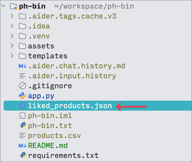
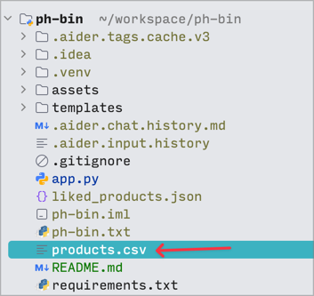

# Product Hunt Like or Not

Product Hunt products in a Hot or Not style interface, 
allowing users to browse through products, like them, and save their favorites.


**Liked** products are saved to `liked_products.json`



## Dataset

Download the dataset from the following page and save it in the current directory as `products.csv`

https://components.one/datasets/product-hunt-products



## Setup and Installation

- Python 3.x

1. Clone the repository:

```shell
git clone https://github.com/namuan/ph-bin.git
cd ph-bin
```

2. Create a virtual environment and activate it:

```shell
python -m venv venv
source venv/bin/activate # On Windows, use venv\Scripts\activate
```
Install the required packages:

```shell
pip install -r requirements.txt
```

Ensure you have a `products.csv` file in the root directory with the required product data. 
See **Dataset** section above 

Run the Flask application:

```shell
python app.py
```

Open your web browser and navigate to `http://localhost:5011` to use the application.

## Data Ownership Disclaimer

The product data used in this application belongs to Product Hunt. 
This project is for educational and demonstration purposes only. 
Please respect Product Hunt's terms of service and data usage policies when using or deploying this application publicly.

## Contributing

Contributions are welcome! Please feel free to submit a Pull Request.

## License

This project is open source and available under the [MIT License](LICENSE).
